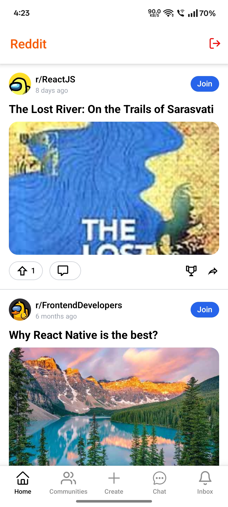
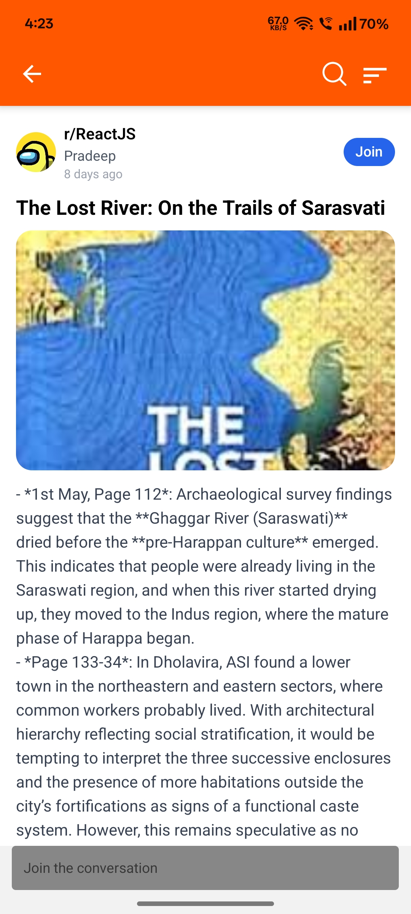
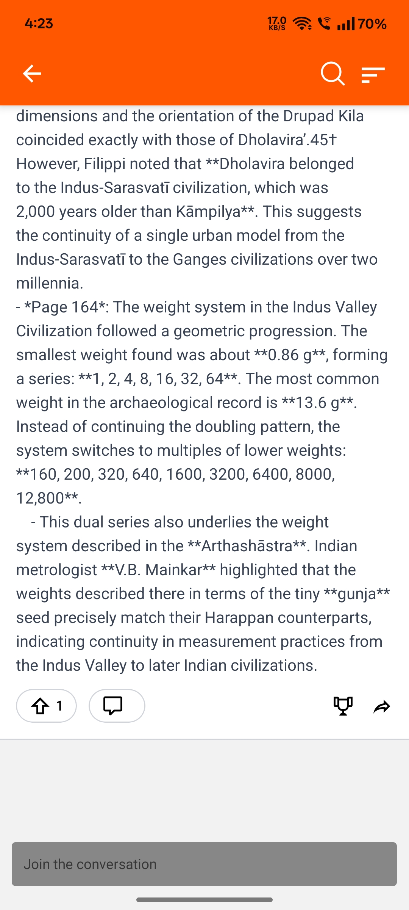
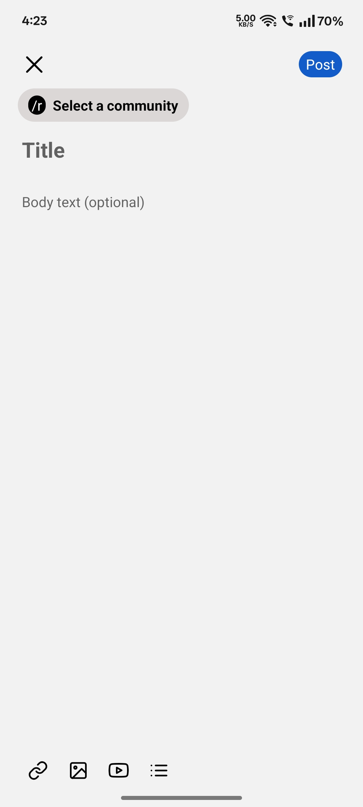
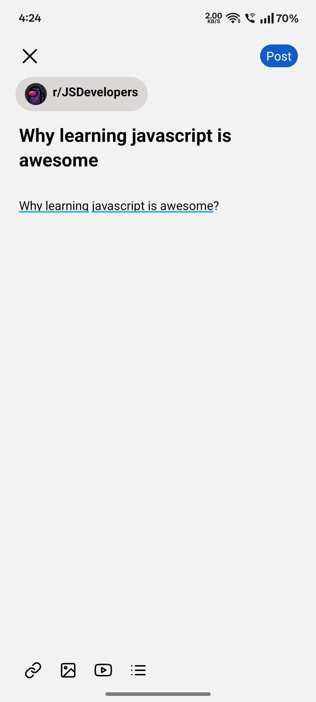

# Reddit Clone App

A fully functional Reddit-style mobile application built with modern technologies.

---

## Tech Stack

* **React Native (Expo)** – Cross-platform mobile development.
* **Supabase** – Backend-as-a-Service for database and real-time features.
* **Clerk** – Authentication and user management.
* **React Query** – Data fetching and caching.
* **Tailwind CSS (via NativeWind)** – Utility-first styling (optional but common).
* **TypeScript** – Safer, strongly-typed development.

---

## Images

